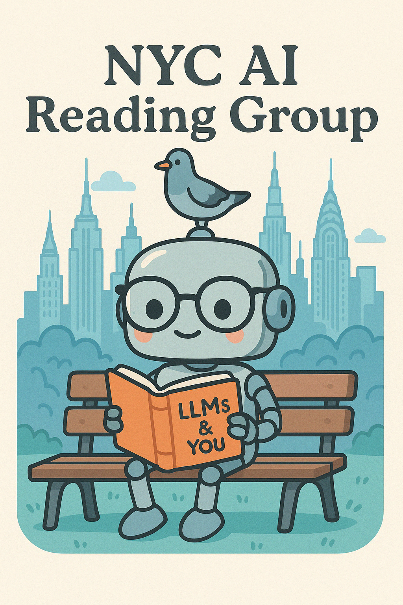

# The NYC AI Reading Group

NYC AI is so back :rocket:.

## About

The **NYC AI Reading Group** brings together AI researchers and practitioners to:
- Stay up to date with frontier AI research
- Meet and engage with thoughtful, curious minds re: the above
- Imbibe copious amounts of caffeine and ~knowledge~
- Build an enduring AI community in the greatest city in the world

## Schedule

- **Frequency**: Biweekly/Monthly meetings
- **Duration**: 1.5-2 hours per session
- **Location**: immediately, Haize Labs HQ in FiDi; may expand to larger venues in the near future

## How to Participate

Join our community:
   - Sign up for our [mailing list](https://atrui71w.paperform.co/)
   - Join our [Discord server](https://discord.gg/gZQFmWXK)

Paper suggestions are welcome from all participants.

## Code of Conduct

NYC AI Reading Group is an environment that is meant to be universally engaging for all participants. Please:
- Listen with intent and respect to others' questions and suggestions
- Do not monopolize the conversation
- Come sufficiently prepared; do not waste other people's time on banal questions

## Contributing

We welcome contributions to make this reading group better:
- Suggest papers for discussion
- Help organize sessions
- Share resources and notes
- Provide feedback

## Contact

{ leonard@haizelabs.com, nimit@haizelabs.com, w.brown@columbia.edu }

---

*This is a living document. Feel free to suggest improvements or additions.*

